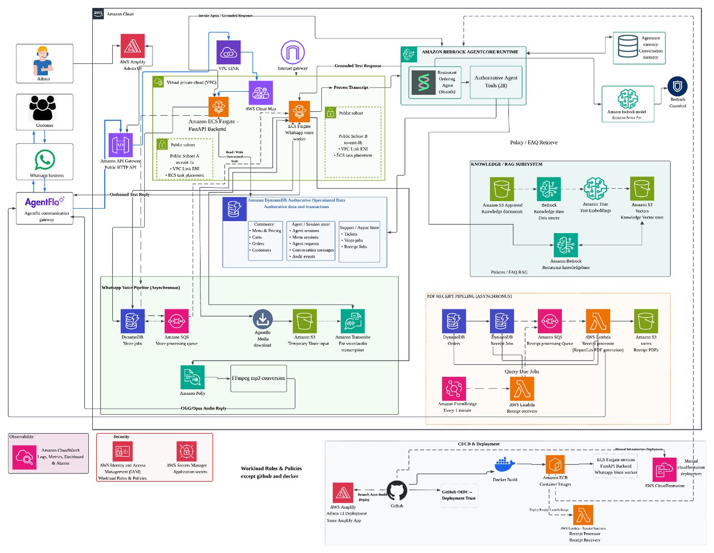
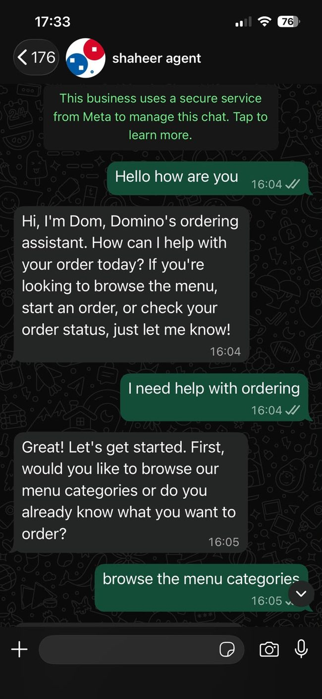
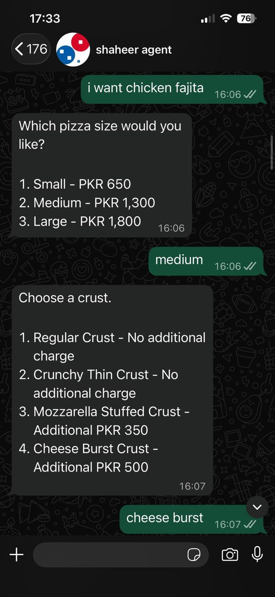
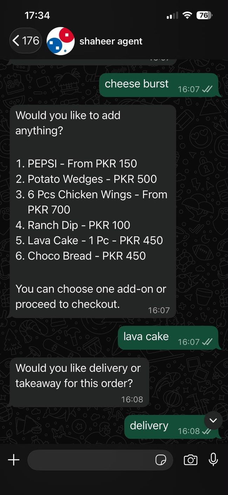
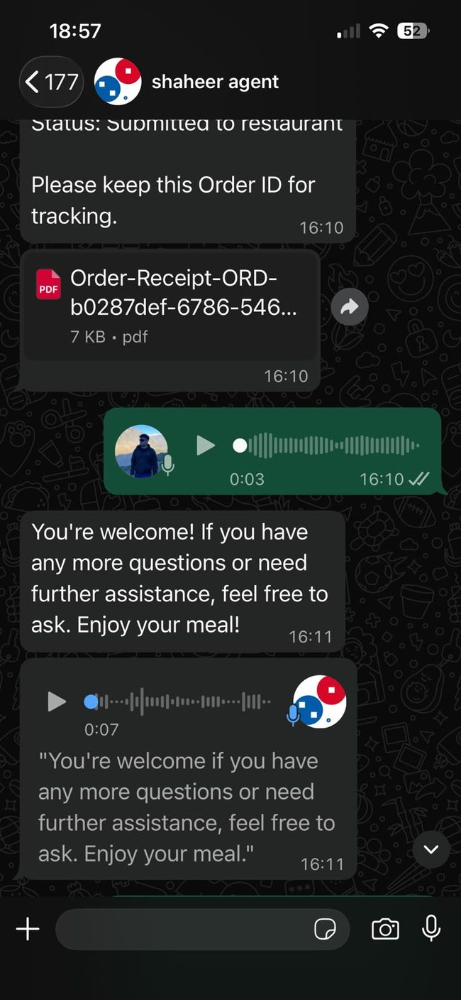
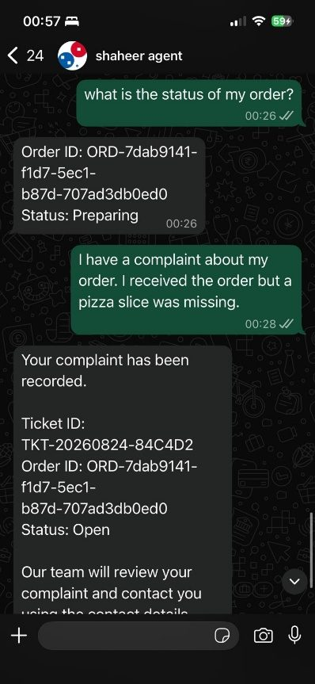
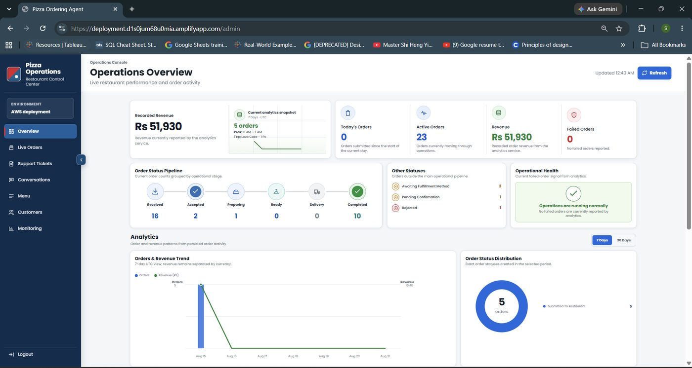
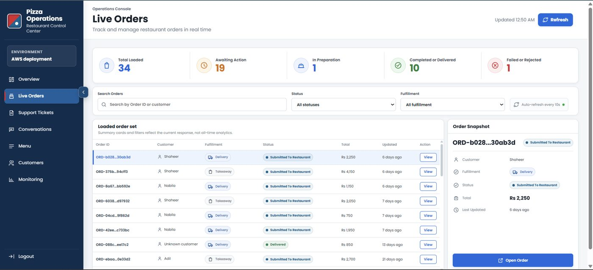
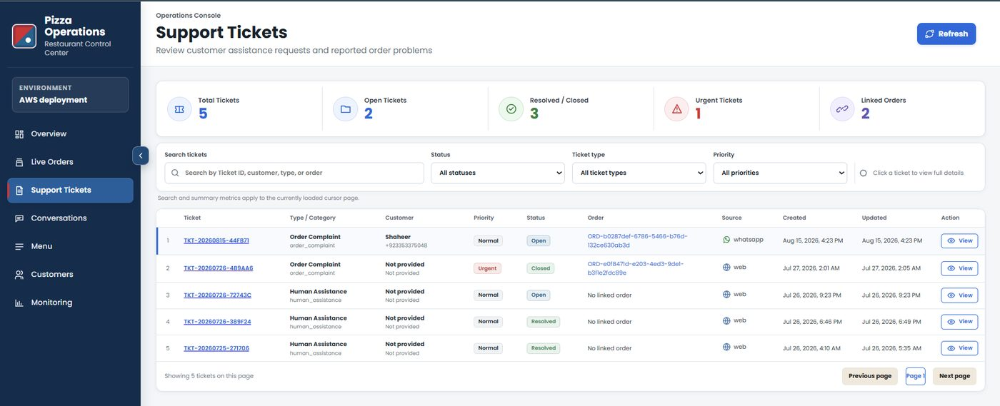
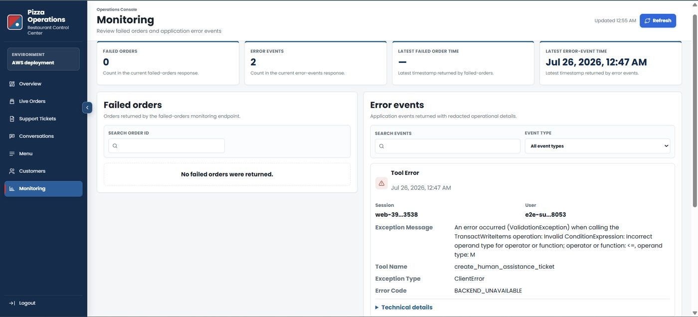

<div align="center">

# Cloud-Based Agentic AI Restaurant Customer Engagement System

### WhatsApp Ordering · Agentic AI · Voice Processing · RAG · AWS Cloud Infrastructure

**Final Year Project · Industrial Sponsored by Salesflo**

[](https://aws.amazon.com/)
[](https://www.python.org/)
[](https://fastapi.tiangolo.com/)
[](https://www.docker.com/)
[](https://github.com/features/actions)

</div>

---

## Overview

This project is a cloud-deployed **agentic AI restaurant customer engagement system** that allows customers to interact with a restaurant directly through WhatsApp.

The system supports the full customer journey, including menu discovery, product customization, cart management, delivery or takeaway selection, order confirmation, PDF receipts, order-status enquiries, complaints, and voice interaction.

Instead of allowing a language model to directly control restaurant data, the system separates **AI reasoning** from **authoritative business execution**. The agent interprets customer intent and selects registered tools, while deterministic backend services validate and execute operations against authoritative application data.

### What the system supports

- Natural-language WhatsApp ordering
- Multi-turn conversations with persistent context
- Menu search and guided item customization
- Cart management and optional upselling
- Delivery and takeaway workflows
- Authoritative order confirmation and status tracking
- PDF receipt generation and delivery
- Customer complaints and support-ticket workflows
- WhatsApp voice-note transcription and synthesized voice replies
- Grounded policy / FAQ responses using RAG
- Administrative operations dashboard
- Cloud monitoring, alarms, logging, and CI/CD

---

## AWS Deployment Architecture

<p align="center">
  
</p>

### Main request path

```text
Customer
  ↓
WhatsApp Business
  ↓
Salesflo Agentflo
  ↓
Amazon API Gateway
  ↓
VPC Link
  ↓
AWS Cloud Map
  ↓
Amazon ECS Fargate / FastAPI
  ↓
Amazon Bedrock AgentCore Runtime
  ↓
Authoritative Tools + DynamoDB / Knowledge Base
  ↓
Grounded Response
  ↓
WhatsApp
```

The administrative interface follows a separate path through **AWS Amplify → API Gateway → VPC Link → Cloud Map → ECS Fargate**, while sharing the same backend and authoritative operational data.

---

## Agentic AI Design

The conversational layer is built around a **Strands-based restaurant agent** hosted in **Amazon Bedrock AgentCore Runtime**.

| Component | Responsibility |
|---|---|
| **Amazon Bedrock AgentCore Runtime** | Hosts the production conversational agent |
| **Amazon Nova Pro** | Foundation model used for reasoning and response generation |
| **AgentCore Memory** | Maintains model-facing conversational context across interactions |
| **Bedrock Guardrails** | Applies content and sensitive-information controls |
| **Authoritative Agent Tools** | Connect agent reasoning to validated business operations |
| **Amazon DynamoDB** | Stores authoritative operational state |
| **Bedrock Knowledge Bases** | Retrieves approved restaurant policies and informational content |

A key design principle is that the language model **does not directly mutate authoritative business data**. Transactions such as pricing, cart updates, order submission, customer data, and support operations are performed by deterministic backend services.

---

## Customer Experience

### 1. Conversational Ordering

Customers can start naturally in WhatsApp, browse menu categories, request specific products, or ask for recommendations.

<table>
<tr>
<td width="50%" align="center"><b>Starting an Order</b></td>
<td width="50%" align="center"><b>Item Customization</b></td>
</tr>
<tr>
<td></td>
<td></td>
</tr>
</table>

The ordering flow collects authoritative product choices step by step, including size, crust, quantity, and other required customization options.

### 2. Upselling and Fulfilment

After customization, the system can offer eligible add-ons before moving into checkout and fulfilment selection.

<p align="center">
  
</p>

The same flow supports both **delivery** and **takeaway**, with the backend maintaining authoritative cart and order state throughout the conversation.

### 3. Voice Interaction

WhatsApp voice notes are handled asynchronously so speech processing does not block normal text requests.

<p align="center">
  
</p>

```text
WhatsApp Voice Note
       ↓
Amazon SQS
       ↓
ECS Fargate Voice Worker
       ↓
Amazon S3 Temporary Media
       ↓
Amazon Transcribe
       ↓
AgentCore Runtime
       ↓
Grounded Text Response
       ↓
Amazon Polly
       ↓
FFmpeg → OGG/Opus
       ↓
WhatsApp Text + Voice Reply
```

The voice workflow reuses the **same customer identity, session context, authoritative tools, and grounding controls** as text interactions.

### 4. Customer Support and Complaints

Customers can check order status, request assistance, submit order complaints, and retrieve ticket status through the same WhatsApp conversation.

<p align="center">
  
</p>

Support tickets preserve order context, customer references, priority, status, administrative notes, and ticket history for operational follow-up.

---

## Administrative Operations Console

The administrative interface is a **Next.js / React / TypeScript** application deployed through **AWS Amplify**.

It provides dedicated workspaces for:

- Operations overview and analytics
- Live order management
- Support tickets
- Conversation inspection
- Menu management
- Customer profiles and order history
- System monitoring

### Operations Overview

<p align="center">
  
</p>

### Live Orders

<p align="center">
  
</p>

### Support Tickets

<p align="center">
  
</p>

### Monitoring

<p align="center">
  
</p>

---

## Retrieval-Augmented Generation

Approved restaurant documents are kept separate from live transactional state.

```text
Approved Documents
      ↓
Amazon S3
      ↓
Bedrock Knowledge Base
      ↓
Titan Text Embeddings
      ↓
Amazon S3 Vectors
      ↓
Knowledge Retrieval Tool
      ↓
AgentCore Runtime
```

This subsystem is used for document-oriented information such as policies, frequently asked questions, operating information, delivery guidance, privacy information, and other approved restaurant knowledge.

Live information such as **prices, carts, orders, customers, and support state** is retrieved from authoritative operational services instead of the RAG layer.

---

## Asynchronous PDF Receipt Pipeline

Receipt generation is separated from the synchronous order-confirmation path.

```text
Confirmed Order
      ↓
DynamoDB Receipt Job
      ↓
Amazon SQS
      ↓
AWS Lambda
      ↓
ReportLab PDF Generation
      ↓
Amazon S3
      ↓
Salesflo Agentflo
      ↓
WhatsApp Customer
```

**Amazon EventBridge** periodically invokes a recovery function that identifies due receipt jobs and requeues incomplete work when required.

---

## Operational Data Layer

The implementation uses **12 Amazon DynamoDB tables** with an access-pattern-oriented NoSQL design.

Operational domains include:

- Customers
- Agent Sessions
- Carts
- Orders
- Menu Sessions
- Conversation Messages
- Agent Requests
- Support Tickets
- Receipt Jobs
- WhatsApp Voice Jobs
- Menu Catalog
- Audit Events

Tables use composite `PK` / `SK` keys, with **GSIs** added only for required alternative access patterns. Time to Live is applied selectively to temporary session, conversation, support, request, and background-processing records.

All documented tables use **PAY_PER_REQUEST** capacity mode.

---

## Cloud & Technology Stack

### AWS

`Amazon VPC` `API Gateway` `VPC Link` `AWS Cloud Map` `ECS Fargate`  
`Amazon ECR` `AWS Amplify` `Bedrock AgentCore Runtime` `AgentCore Memory`  
`Amazon Nova Pro` `Bedrock Guardrails` `Bedrock Knowledge Bases`  
`Titan Text Embeddings` `Amazon S3 Vectors` `DynamoDB` `S3` `SQS`  
`Lambda` `EventBridge` `Transcribe` `Polly` `CloudWatch`  
`Secrets Manager` `IAM` `CloudFormation`

### Application & DevOps

`Python` `FastAPI` `Uvicorn` `Strands Agents SDK` `Next.js` `React`  
`TypeScript` `Docker` `GitHub` `GitHub Actions` `ReportLab` `FFmpeg`

### External Integration

`WhatsApp Business Platform` `Salesflo Agentflo`

---

## Monitoring and Reliability

Amazon CloudWatch is used for application and infrastructure observability across the major workloads.

The implemented monitoring environment includes:

- Centralized application logs
- ECS / container monitoring
- Operational metrics
- CloudWatch dashboards
- Failure visibility for asynchronous workflows
- **15 CloudWatch alarms** across the deployed system
- Redacted audit / application error records for troubleshooting

Asynchronous voice and receipt workflows maintain durable job state to support retries and controlled recovery instead of silently losing long-running work.

---

## CI/CD and Deployment

The deployment workflow uses **GitHub, GitHub Actions, GitHub OIDC, Docker, Amazon ECR, AWS Amplify, and AWS CloudFormation**.

```text
GitHub
  ├── GitHub Actions / OIDC
  │       ↓
  │    Docker Build
  │       ↓
  │    Amazon ECR
  │       ↓
  │    ECS Fargate
  │
  └── Admin UI Branch
          ↓
      AWS Amplify
```

CloudFormation is used to define and deploy the major infrastructure stacks, including networking, backend services, monitoring resources, GitHub OIDC integration, and knowledge-base infrastructure.

---

## Repository Structure

```text
.
├── .github/           # GitHub Actions workflows
├── agent-runtime/     # AgentCore runtime implementation
├── backend/           # FastAPI backend and business services
├── frontend/          # Administrative web application
├── infra/             # AWS CloudFormation infrastructure
├── docs/              # Project documentation
├── ARCHITECTURE.md
├── AWS_RESOURCES.md
├── DEPLOYMENT_GUIDE.md
├── DEPLOYMENT_CHECKLIST.md
└── ENVIRONMENT_VARIABLES.md
```

---

## Technical Documentation

- [System Architecture](ARCHITECTURE.md)
- [AWS Resources](AWS_RESOURCES.md)
- [Deployment Guide](DEPLOYMENT_GUIDE.md)
- [Deployment Checklist](DEPLOYMENT_CHECKLIST.md)
- [Environment Variables](ENVIRONMENT_VARIABLES.md)

---

## Key Engineering Decisions

### AI reasoning is not the source of truth
The model interprets intent and selects tools, but deterministic services own transactional execution.

### Operational data and RAG are separated
Dynamic data such as prices, carts, orders, and customers comes from authoritative services. Approved policies and informational documents come from the knowledge base.

### Slow workloads are asynchronous
Voice processing and PDF generation are decoupled through SQS so they do not block normal customer interactions.

### Business state survives conversations
DynamoDB persists authoritative customer, cart, order, support, conversation, and job state independently of model memory.

### Observability is part of the architecture
Monitoring, auditability, alarms, and controlled recovery were designed into the deployed environment rather than added only after implementation.

---

## Project Status

The project was implemented and deployed on AWS as a working final-year system, including:

- WhatsApp text ordering
- WhatsApp voice interaction
- Agentic AI orchestration
- Grounded RAG responses
- Persistent conversation context
- Authoritative cart and order workflows
- PDF receipt generation
- Complaint / support workflows
- Administrative operations console
- AWS monitoring and alarms
- CI/CD and cloud deployment

---

## Author

**Shaheer Tariq**  
Bachelor of Information Technology (Hons) in Cloud Computing  
Asia Pacific University of Technology & Innovation

[LinkedIn](https://www.linkedin.com/in/shaheertariq01) · [GitHub](https://github.com/shaheertariq0111)

---

> **Note:** This repository represents an academic / industrial-sponsored final-year project. Secrets, credentials, private keys, and environment-specific sensitive values are intentionally excluded from the repository.
